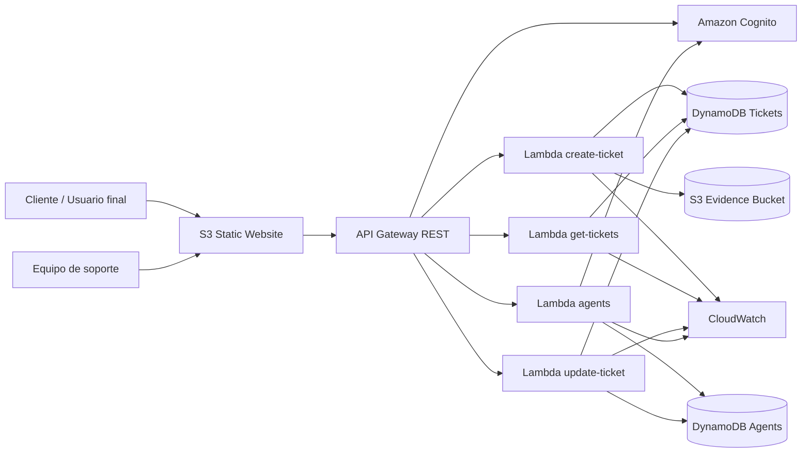

# NexaCloud Betek Support Portal

Portal serverless de soporte técnico para crear, consultar, asignar y cerrar tickets en AWS. El proyecto incluye frontend estático, API REST, funciones Lambda, autenticación con Cognito, persistencia en DynamoDB, evidencias en S3 y despliegue con Terraform.

## Tabla de contenido

- [Descripción general](#descripción-general)
- [Descripción del proyecto](#descripción-del-proyecto)
- [Características](#características)
- [Arquitectura](#arquitectura)
- [Stack tecnológico](#stack-tecnológico)
- [Estructura del repositorio](#estructura-del-repositorio)
- [Ejecución y despliegue](#ejecución-y-despliegue)
- [Documentación](#documentación)
- [Seguridad](#seguridad)
- [Licencia](#licencia)

## Descripción general

NexaCloud Betek Support Portal permite a los clientes registrar solicitudes de soporte y hacer seguimiento público por número de ticket. El equipo de soporte puede iniciar sesión, visualizar tickets, asignarlos a agentes, agregar notas internas, responder al cliente y avanzar el estado del caso hasta su cierre.

## Descripción del proyecto

El repositorio incluye el documento base del proyecto entregado como enunciado académico/técnico. Este archivo describe el contexto, la necesidad, los objetivos, requisitos y criterios de éxito de la solución:

- Resumen en Markdown: [`docs/PROJECT_DESCRIPTION.md`](docs/PROJECT_DESCRIPTION.md)
- PDF original: [`docs/assets/project-description.pdf`](docs/assets/project-description.pdf)

## Características

- Creación pública de tickets desde formulario web.
- Seguimiento público por número de ticket.
- Panel privado para equipo de soporte autenticado con Amazon Cognito.
- Gestión de estados: `open`, `assigned`, `in-progress`, `resolved`, `closed`.
- Gestión de agentes de soporte.
- Carga de imagen de evidencia hasta 2 MB.
- Persistencia en DynamoDB con cifrado y recuperación point-in-time.
- Frontend desplegado como sitio estático en Amazon S3.
- Backend serverless con AWS Lambda y API Gateway.
- Monitoreo básico con CloudWatch Logs y alarmas.
- Despliegue reproducible con Terraform.
- Workflows de GitHub Actions para validación CI y despliegue Terraform.

## Arquitectura

### Diagrama de infraestructura

La documentación incluye el diagrama visual de la infraestructura y también el archivo fuente editable en Draw.io:

- Imagen: [`docs/assets/nexacloud-betek-arquitectura-aws.png`](docs/assets/nexacloud-betek-arquitectura-aws.png)
- Archivo editable: [`docs/assets/NexaCloud_Arquitectura_AWS_basica.drawio`](docs/assets/NexaCloud_Arquitectura_AWS_basica.drawio)




Consulta el detalle técnico en [`docs/ARCHITECTURE.md`](docs/ARCHITECTURE.md).

## Stack tecnológico

| Capa | Tecnología |
|---|---|
| Frontend | HTML5, CSS3, JavaScript vanilla |
| Autenticación | Amazon Cognito User Pool |
| API | Amazon API Gateway REST API |
| Backend | AWS Lambda con Python 3.12 |
| Base de datos | Amazon DynamoDB |
| Archivos | Amazon S3 |
| Observabilidad | Amazon CloudWatch |
| Infraestructura como código | Terraform |
| CI/CD | GitHub Actions |

## Estructura del repositorio

```text
backend/                 Funciones Lambda en Python
webpages/                Frontend estático
terraform/               Infraestructura como código
terraform/environments/  Configuración profesional por ambiente
doc/                     Material del proyecto original
docs/                    Documentación técnica para GitHub
.github/workflows/       Workflow opcional de despliegue
```

Más detalle en [`docs/PROJECT_STRUCTURE.md`](docs/PROJECT_STRUCTURE.md).

## Ejecución y despliegue

### Requisitos

- Cuenta AWS con permisos para S3, Lambda, API Gateway, DynamoDB, Cognito, IAM y CloudWatch.
- Terraform >= 1.5.
- AWS CLI configurado o credenciales disponibles en GitHub Secrets.
- Para GitHub Actions, el backend remoto se crea automáticamente. Para despliegue local, puedes usar un backend S3 propio.

### Configuración local

El proyecto usa archivos de ambiente con nombres profesionales dentro de `terraform/environments/`:

```text
terraform/environments/development.tfvars
terraform/environments/production.tfvars
```

Estos archivos contienen configuración no sensible. El correo y la contraseña temporal del administrador se configuran por variables de entorno:

```bash
cd terraform
export TF_VAR_admin_email="tu-correo@dominio.com"
export TF_VAR_admin_temp_password='Temporal123!'
terraform init \
  -backend-config="bucket=TU_BUCKET_TFSTATE" \
  -backend-config="key=nexacloud-betek/dev/terraform.tfstate" \
  -backend-config="region=us-east-1" \
  -backend-config="dynamodb_table=TU_TABLA_TF_LOCKS" \
  -backend-config="encrypt=true"
terraform fmt -recursive
terraform validate
terraform plan -var-file=environments/development.tfvars
terraform apply -var-file=environments/development.tfvars
```

> Importante: no subas archivos locales con contraseñas, credenciales AWS o datos privados. Usa variables de entorno o GitHub Secrets.

### GitHub Actions

El repositorio incluye dos workflows:

- `.github/workflows/ci.yml`: valida Python y Terraform.
- `.github/workflows/terraform-deploy.yml`: despliega o destruye infraestructura con Terraform.

Para usar el despliegue, configura estos Secrets en GitHub:

```text
AWS_ACCESS_KEY_ID
AWS_SECRET_ACCESS_KEY
TF_ADMIN_EMAIL
TF_ADMIN_TEMP_PASSWORD
```

Más detalle en [`docs/DEPLOYMENT.md`](docs/DEPLOYMENT.md) y [`docs/GITHUB_ACTIONS.md`](docs/GITHUB_ACTIONS.md).

## Documentación

- [`docs/ARCHITECTURE.md`](docs/ARCHITECTURE.md): arquitectura y flujo del sistema.
- [`docs/API.md`](docs/API.md): endpoints, cuerpos de petición y respuestas.
- [`docs/ACCESS_CONTROL.md`](docs/ACCESS_CONTROL.md): separación entre zona pública, soporte y administración.
- [`docs/DEPLOYMENT.md`](docs/DEPLOYMENT.md): despliegue local y CI/CD.
- [`docs/GITHUB_ACTIONS.md`](docs/GITHUB_ACTIONS.md): configuración de CI/CD con GitHub Actions.
- [`docs/LOCAL_DEVELOPMENT.md`](docs/LOCAL_DEVELOPMENT.md): guía de desarrollo local.
- [`docs/OPERATIONS.md`](docs/OPERATIONS.md): monitoreo, logs y solución de problemas.
- [`docs/PROJECT_STRUCTURE.md`](docs/PROJECT_STRUCTURE.md): estructura de carpetas.
- [`docs/USER_GUIDE.md`](docs/USER_GUIDE.md): guía funcional para usuarios y soporte.
- [`SECURITY.md`](SECURITY.md): recomendaciones y reporte de seguridad.
- [`CONTRIBUTING.md`](CONTRIBUTING.md): lineamientos para contribuir.

## Seguridad

Antes de publicar el proyecto en GitHub:

1. No subas credenciales AWS ni contraseñas.
2. Usa GitHub Secrets para valores sensibles.
3. Cambia cualquier contraseña temporal usada en pruebas.
4. Revisa los permisos públicos de los buckets S3.
5. Los endpoints administrativos ya quedan protegidos con Cognito Authorizer y validación defensiva en Lambda.
6. Para producción, considera OIDC en GitHub Actions en lugar de llaves AWS de larga duración.

## Licencia

Este proyecto usa licencia GPL-3.0. Consulta [`LICENSE`](LICENSE).
