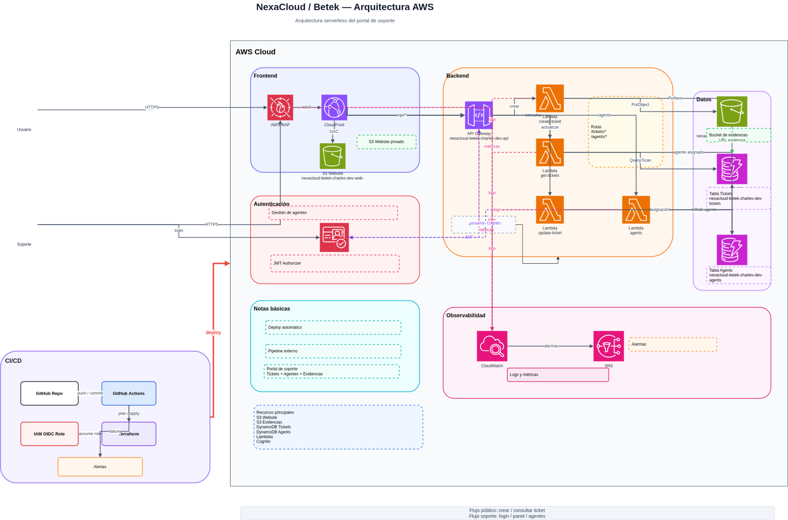
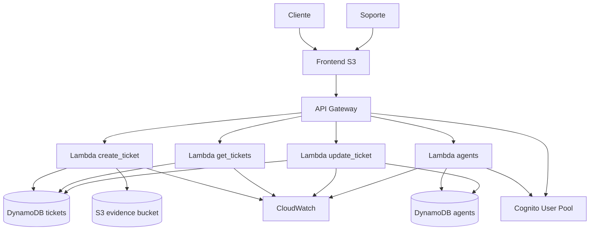

# Arquitectura del sistema

## Diagrama visual de infraestructura

Se adjunta el diagrama visual de la solución y su archivo fuente editable:

- Imagen PNG: [`assets/nexacloud-betek-arquitectura-aws.png`](assets/nexacloud-betek-arquitectura-aws.png)
- Archivo Draw.io: [`assets/NexaCloud_Arquitectura_AWS_basica.drawio`](assets/NexaCloud_Arquitectura_AWS_basica.drawio)



## Visión general

NexaCloud Betek Support Portal es una aplicación serverless desplegada en AWS. La solución separa el frontend estático, la API, la lógica de negocio y la persistencia de datos.

## Componentes principales

| Componente | Servicio | Responsabilidad |
|---|---|---|
| Frontend | Amazon S3 Static Website | Publica las páginas HTML/CSS/JS del portal. |
| API | Amazon API Gateway REST | Expone endpoints HTTP para tickets y agentes. |
| Autenticación | Amazon Cognito | Gestiona usuarios del panel de soporte. |
| Backend | AWS Lambda | Ejecuta la lógica de negocio en Python. |
| Tickets | DynamoDB | Guarda tickets, estados, notas y respuestas. |
| Agentes | DynamoDB | Guarda datos básicos de agentes de soporte. |
| Evidencias | Amazon S3 | Almacena imágenes adjuntas al ticket. |
| Logs | CloudWatch Logs | Registra ejecución de Lambdas. |
| Alarmas | CloudWatch Alarms | Detecta errores o duración elevada. |

## Diagrama lógico



## Flujo de creación de ticket

1. El cliente ingresa al formulario público.
2. El frontend envía `POST /tickets/create` a API Gateway.
3. API Gateway invoca la Lambda `create_ticket`.
4. La Lambda valida campos obligatorios, categoría, prioridad y correo.
5. Si existe imagen de evidencia, se sube al bucket S3 de evidencias.
6. Se crea el registro en DynamoDB con estado inicial `open`.
7. La API responde con `ticketId` para seguimiento.

## Flujo de seguimiento público

1. El cliente consulta su número de ticket.
2. El frontend consume `GET /tickets/track/{id}`.
3. La Lambda `get_tickets` devuelve una vista pública limitada.
4. El cliente puede responder usando `PUT /tickets/{id}/reply`.

## Flujo de soporte

1. El soporte inicia sesión con Cognito desde `/login/login.html`.
2. El token se guarda en `sessionStorage`.
3. El panel consume endpoints protegidos o administrativos.
4. El soporte puede listar, asignar, responder, agregar notas y cambiar estados.
5. Los cambios quedan en DynamoDB y se registran en `stateHistory`, `customerReplies` o `notes` según aplique.

## Modelo de estados

```mermaid
stateDiagram-v2
  [*] --> open
  open --> assigned: asignar agente
  assigned --> in-progress: iniciar atención
  in-progress --> resolved: marcar resuelto
  resolved --> closed: cerrar ticket
```

## Decisiones técnicas

- Se usa S3 static website para simplificar hosting del frontend.
- Se usa API Gateway REST con integración proxy para delegar validación a Lambda.
- Se usa DynamoDB en modo `PAY_PER_REQUEST` para evitar aprovisionamiento manual.
- Se usa Cognito sin librerías de build en frontend para mantener el proyecto simple.
- Terraform empaqueta las Lambdas usando `archive_file`.
- `api-config.js` se genera desde Terraform para inyectar URL real del API y datos de Cognito.

## Archivo editable del diagrama

Si necesitas modificar la arquitectura, abre el archivo `assets/NexaCloud_Arquitectura_AWS_basica.drawio` en [draw.io / diagrams.net](https://app.diagrams.net/).

## Consideraciones para producción

- Migrar frontend a CloudFront + Origin Access Control si se requiere HTTPS propio y mayor seguridad.
- Proteger todos los endpoints administrativos en API Gateway con Cognito Authorizer.
- Evitar buckets públicos para evidencias sensibles; usar URLs firmadas si las evidencias contienen información privada.
- Agregar validación de tamaño y tipo de archivo también desde el frontend.
- Crear índices secundarios en DynamoDB si crece el volumen de tickets o se requieren búsquedas por correo, estado o agente.
